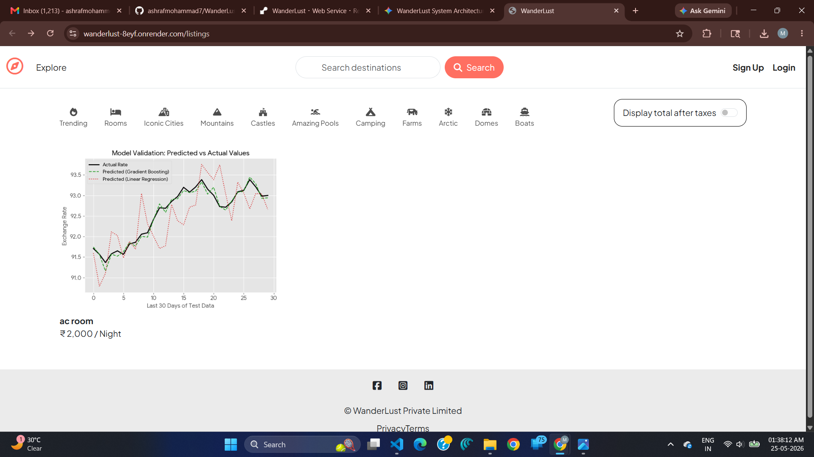

# WanderLust 🌍


A full-stack Airbnb-inspired travel listing web application where users can explore destinations, create listings, upload property images, search locations, and manage authentication securely.

---

## 🚀 Live Demo

🌐 https://wanderlust-8eyf.onrender.com

---

# ✨ Features

- 🔐 User Authentication (Signup/Login/Logout)
- 🏡 Create, Edit & Delete Listings
- 📷 Cloudinary Image Upload Support
- ⭐ Add & Delete Reviews
- 🔎 Destination Search Functionality
- 🗂 Category-Based Filtering
- 📱 Responsive User Interface
- ☁ MongoDB Atlas Integration
- 🍪 Session & Cookie Authentication
- ⚡ Flash Messages & Error Handling
- 🚀 Production Deployment on Render

---

# 📸 Application Screenshots

## 🏠 Home Page

Displays all travel listings with category filters and search functionality.



---

## 🔐 User Login Page

Secure authentication using Passport.js.


---

## 📝 User Signup Page

New users can register securely.


---

## ✅ Authenticated User Interface

Navbar dynamically changes after successful login.


---

## ➕ Create New Listing

Users can create and upload new travel destinations.


---

## 🗂 Category Filtering

Listings can be filtered using categories.


---

## 🏙 Successfully Added Listing

Demonstrates successful listing creation with image upload.


---

# 🛠 Tech Stack

## Frontend
- HTML5
- CSS3
- Bootstrap 5
- EJS Templates

## Backend
- Node.js
- Express.js

## Database
- MongoDB Atlas
- Mongoose

## Authentication
- Passport.js
- express-session

## Cloud Storage
- Cloudinary
- Multer

## Deployment
- Render

---


# 🏗 System Architecture

The following diagram represents the overall architecture and workflow of the WanderLust application.


---

# 📂 Project Structure

```bash
WanderLust/
│
├── controllers/
├── middleware/
├── models/
├── routes/
├── screenshots/
├── public/
│   ├── css/
│   ├── js/
│   └── images/
│
├── utils/
├── views/
│   ├── includes/
│   ├── layouts/
│   ├── listings/
│   ├── users/
│   └── error.ejs
│
├── cloudConfig.js
├── middleware.js
├── schema.js
├── app.js
├── package.json
└── README.md
```

---

# ⚙ Environment Variables

Create a `.env` file in the root directory and add:

```env
ATLASDB_URL=your_mongodb_connection_string

SECRET=your_secret_key

CLOUD_NAME=your_cloudinary_name
CLOUD_API_KEY=your_cloudinary_api_key
CLOUD_API_SECRET=your_cloudinary_api_secret

MAP_TOKEN=your_mapbox_token
```

---

# 📦 Installation & Setup

## Clone Repository

```bash
git clone https://github.com/ashrafmohammad7/WanderLust.git
```

---

## Navigate to Project Folder

```bash
cd WanderLust
```

---

## Install Dependencies

```bash
npm install
```

---

## Run Application

```bash
npm start
```

---

# 🌐 Deployment

This application is deployed on Render.

🔗 https://wanderlust-8eyf.onrender.com

---

# 📚 Learning Outcomes

- Full Stack Web Development
- RESTful Routing
- Authentication & Authorization
- MVC Architecture
- MongoDB Integration
- Cloudinary File Uploads
- Deployment & Production Debugging
- Session Management
- Backend Validation & Error Handling

---

# 🧠 Future Improvements

- ❤️ Wishlist Feature
- 💳 Payment Gateway Integration
- 📍 Interactive Maps
- 📧 Email Verification
- 🌙 Dark Mode UI
- 📱 Progressive Web App (PWA)

---

# 📖 Development Log

Detailed project development history:

📄 [DEVLOG.md](./DEVLOG.md)

---

# 🏗 System Architecture

Detailed project architecture and flow:

📄 [ARCHITECTURE.md](./ARCHITECTURE.md)

---

# 👨‍💻 Author

## Ashraf Mohammad

- GitHub: https://github.com/ashrafmohammad7

---
